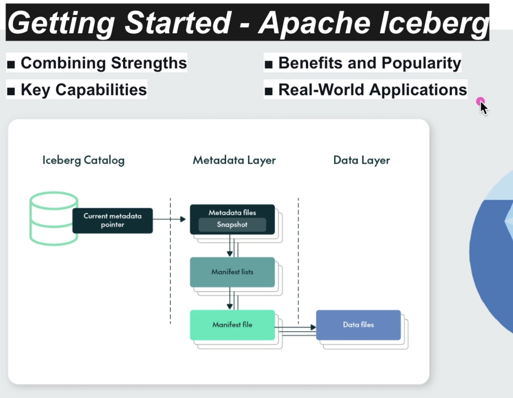
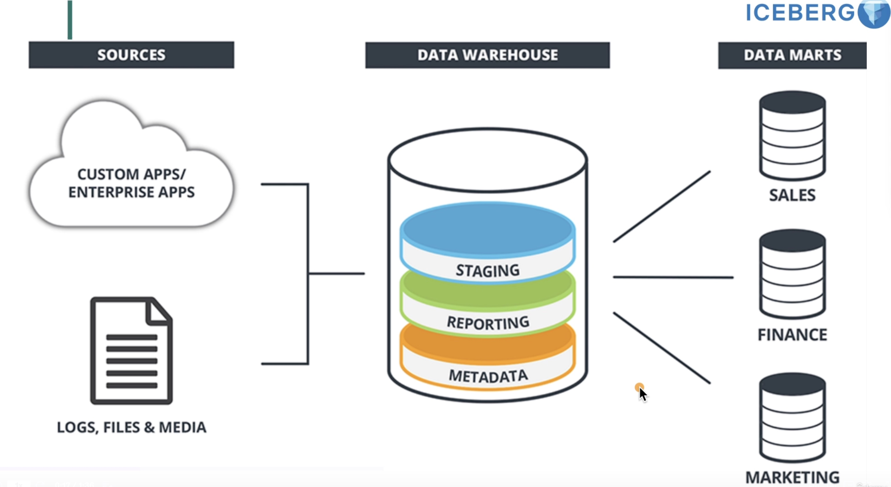
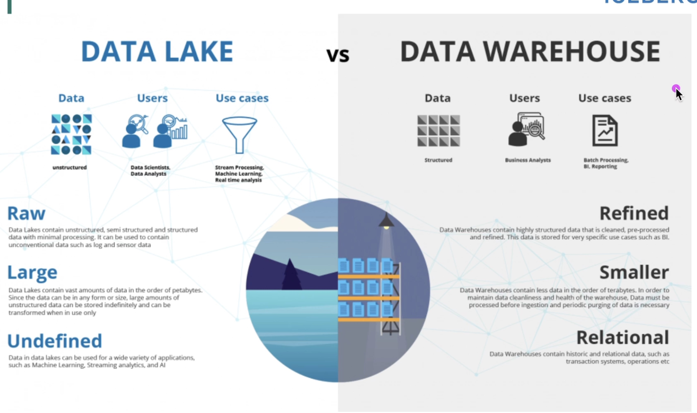

# iceberg
practice of iceberg

# 1. Introduction to Apache Iceberg:

1. Understand what Apache Iceberg is and its use cases.
2. Learn about the problems Iceberg solves in data lakes.
3. Explore the history and development of Apache Iceberg.
4. Review case studies and real-world applications of Iceberg.

# 2. Table Format:

1. Study the Iceberg table format and its components (manifests, snapshots, metadata).
2. Learn how Iceberg tables are structured and how they differ from traditional table formats.
3. Examine the benefits of Iceberg's table format in terms of performance and scalability.
4. Compare Iceberg's table format with other modern table formats like Delta Lake and Hudi.

# 3. Schema Evolution:

1. Understand how Iceberg handles schema evolution without requiring table rewrites.
2. Learn about adding, dropping, renaming, and updating columns.
3. Explore the impact of schema changes on existing data and queries.
4. Review best practices for managing schema evolution in Iceberg.

# 4. Partitioning:

1. Study Iceberg's approach to partitioning and how it differs from traditional Hive-style partitioning.
2. Learn about hidden partitioning and how to define partition specs.
3. Understand the performance implications of different partitioning strategies.
4. Explore examples of partitioning schemes for common use cases.

# 5. Time Travel:

1. Understand how Iceberg supports time travel queries.
2. Learn how to query historical data and rollback to previous snapshots.
3. Explore the use cases for time travel in data analysis and debugging.
4. Review the limitations and considerations when using time travel in Iceberg.

# 6. Data Compaction:

1. Study the techniques Iceberg uses for data compaction and optimizing storage.
2. Learn about the maintenance operations like expiring snapshots and removing orphan files.
3. Understand the impact of data compaction on query performance.
4. Explore tools and utilities for automating data compaction in Iceberg.

# 7. Integration with Query Engines:

1. Learn how Iceberg integrates with various query engines like Apache Spark, Trino, Flink, and Hive.
2. Study the configuration and usage of Iceberg with these engines.
3. Explore the performance considerations when using Iceberg with different query engines.
4. Review examples of integrating Iceberg with popular data processing frameworks.

# 8. Performance Tuning:

1. Understand the performance tuning options available in Iceberg.
2. Learn about optimizing read and write performance.
3. Explore the impact of different storage formats on Iceberg's performance.
4. Review best practices for monitoring and tuning Iceberg performance.

# 9. Security and Access Control:

1. Study how Iceberg handles security and access control.
2. Learn about integrating Iceberg with data governance tools.
3. Understand the role of encryption and authentication in Iceberg.
4. Explore examples of implementing security policies in Iceberg.

# 10. APIs and Tools:

1. Familiarize yourself with the Iceberg API and its key operations.
2. Learn about the tools and utilities provided by Iceberg for table management.
3. Explore the use of Iceberg's API for custom data processing workflows.
4. Review examples of extending Iceberg with custom plugins and tools.

# 11. Community and Contributions:

1. Engage with the Iceberg community through mailing lists, forums, and GitHub.
2. Learn how to contribute to the Iceberg project.
3. Explore the roadmap and future developments of Apache Iceberg.
4. Review the process for submitting patches and participating in code reviews.

   

# [Udemy Course](https://www.udemy.com/course/getting-started-apache-iceberg/learn/lecture/45702165#overview)

## 1. intro

Iceberg spec: https://iceberg.apache.org/spec/

Iceberg documentation: https://iceberg.apache.org/docs/nightly/

   

## 2. what is iceberg used for?

1. what is data warehouses?

- Introduction to Data Warehouses
    - Definition and role as a centralized repository optimized for analytics and business intelligence.

-  Centralization and Organization
    - Goal of having a well-maintained, organized, and centralized data warehouse that stores most of
an organization’s data.

- Challenges with Structuring Data
    - The complex, messy task of structuring data to fit within a warehouse.
    - Issues arising from the ETL process: data duplication, delays in data availability, and reduced operational flexibility.

- Maintenance Costs and Challenges
    - Ongoing, expensive, and labor-intensive efforts required to maintain a data warehouse.
    - Consequences of inadequate maintenance: reduced data accessibility or a completely ineffective system.

- Evolving Needs and Limitations
    - Persistent challenges with cost, scalability, and maintenance that prompt the need for innovative solutions like Iceberg.

  

2. what is data lake?

- the Concept of a Data Lake
    - Explanation of data lakes storing data in its native format, avoiding rigorous structuring and massive ETL workloads.
    - Highlight the cost reduction and simplification of the data management stack.

- Advantages and Simplification
    - Discussion of the operational streamlining promised by data lakes.
    - Transition: While appealing, this simplicity introduces significant challenges.

- Challenges of Data Lakes
    - Detailed look at the complexities of extracting information from unstructured data.
    - Impact on data scientists and analysts due to advanced requirements for data querying and management.
    - The evolution of data management challenges over time, leading to potential inefficiencies and data
bogs.

- A Thoughtful Consideration
    - Introduction to the idea of hybrid solutions like data lakehouses.
    - A proposed solution that blends the flexibility of data lakes with the structured benefits of data
warehouses.